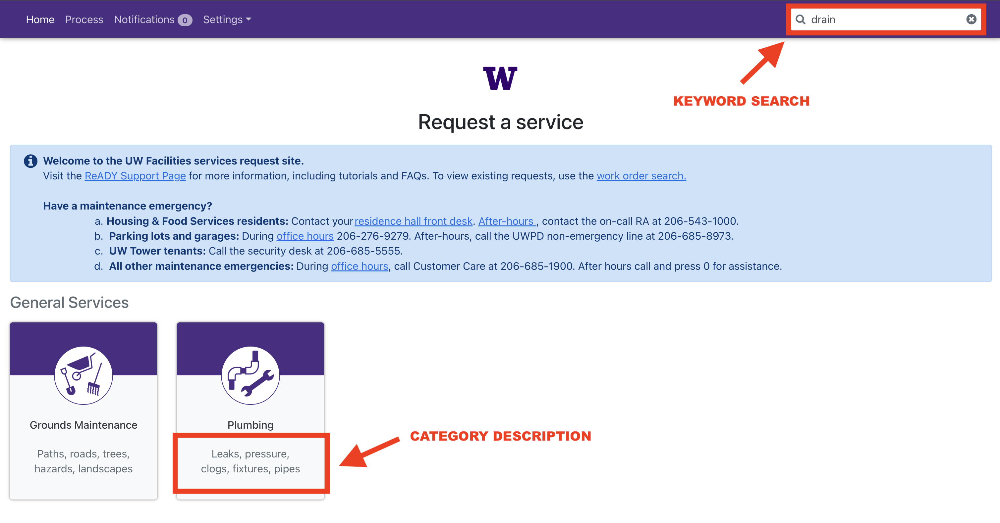

# Optimization of University of Washington Maintenance Request System

---

## Background and Overview
During my internship with the University of Washington Facilities Information Technology Team, I maintained and supported enterprise applications that processed maintenance requests from students, staff, and faculty.

After launching a new request submission portal, my team noticed that many users selected the “Other” category instead of existing ones such as "Plumbing" or "Electrical." This misclassification caused the Customer Care team to manually review and reroute requests, creating delays in resolving maintenance issues.

The project I was given focused on analyzing requests labeled “Other” to identify recurring themes, common service types, and frequent facility issues. The findings aimed to help the IT team:
- Define new service categories where appropriate
- Clarify existing options to improve user selection
- Reduce manual rerouting by Customer Care Team
- Increase request accuracy and processing speed

**Problem Statement**

The high usage of the 'Other' category resulted in unnecessary manual routing and delayed maintenance responses. The goal of the project was to analyze these requests and uncover improvements to reduce misclassification among users.

**Tools Used**

Excel was used to clean and filter data and identify patterns. Tableau was used to visualize category distributions and build the dashboard used by the IT team.

---

## Data Structure Overview
I was provided with a dataset containing all maintenance requests submitted under the “Other” category during the first week of launch. The dataset included 91 records.
| Column Name         | Description                                                  | Data Type  |
|----------------------|--------------------------------------------------------------|-------------|
| work_order_number    | Unique identifier assigned to each maintenance request       | String      |
| work_order_details   | Description of the maintenance request                       | String      |
| property_id          | Code identifying the building or facility location           | String      |
| correct_category     | Category the request should have been classified under       | String      |

---

## Executive Summary
An analysis of 91 maintenance requests submitted under the “Other” category in the first week after release showed clear misclassification patterns. About 74% were categorized incorrectly. Most of these should have been Custodial, Equipment & Furniture, Interior Finishes, Electrical, or Building Access. Together, these five categories made up nearly half of all “Other” submissions. Over 15% reflected missing or unclear categories such as pest issues, asbestos concerns, and pickup or delivery requests. Another 7% involved multiple service areas, often including Electrical.

The project identified three main causes:
- Unclear or broad category names
- Overlapping service definitions
- Missing request types

Based on the analysis and recommendations, two improvements were made:
- Clearer category descriptions in the portal
- Keyword search for request matching

After these updates, “Other” submissions dropped by 20%. Routing accuracy improved, and Customer Care teams handled fewer manual reviews and reassignments.

Below is the overview page from the Tableau dashboard showing key KPIs and the distribution of request categories within "Other" requests from the first week of launch.

---

## Insights Deep Dive
### Misclassified Requests
#### Trends/Patterns
- Of all requests labeled as “Other,” 74% were incorrectly categorized even though appropriate categories already existed.
- The most common miscategorized categories were Custodial (12%), Equipment & Furniture (11%), Interior Finishes (10%), Electrical (8%), and Building Access (7%).
- The top 5 most miscategorized categories accounted for 48% of all “Other” submissions.
  
#### Insights
Users often experience confusion with broad building issues such as cleaning, furniture repair, minor wall or ceiling damage, lighting, and door access, which make up the top 5 five misclassified categories and 48% of all "Other" requests. More specific categories, like Fire Extinguishers or Windows & Coverings, were rarely misused. Users tend to misclassify when category names are too general or overlapping, making it unclear which department should handle the request. There also appears to be frequent use of “Other” when an issue does not perfectly fit a listed category, even when a suitable option exists.
  
### Multi-Category Requests
#### Trends/Patterns
Multi-category requests require two or more facilities teams to complete the work. These can be assigned to any of the relevant teams first, with the initial team reassigning the work order once their portion is complete.
- 7% of “Other” requests involved multiple service categories.
- Electrical appeared in 50% of these multi-category cases.
- When breaking down these requests, 88% of the categories involved were also among the top 10 most frequently misclassified.

#### Insights
About 7% of “Other” requests involved multiple service categories, requiring coordination between two or more teams. While a small share overall, these requests highlight cross-team ambiguity. Half of these cases involved Electrical which was paired with Building Access, Equipment & Furniture, or Custodial services. About 88% of categories in multi-category requests also ranked among the most frequently misclassified. This shows that confusion often occurs at the boundaries between similar service types. For example, users might classify a malfunctioning automatic door opener as Electrical because it involves wiring, or as Building Access because it controls entry. This ambiguity leads to inconsistent classifications and extra review time for the Customer Care team. In some cases, the request may first go to a Facilities team, which addresses its portion before reassigning it to the next group. This is often appropriate, since it allows work to begin without waiting for Customer Care to review and reroute the request.
  
### Emerging or Missing Categories
#### Trends/Patterns
- 4% of requests were related to pests.
- 4% of requests involved asbestos concerns.
- 7% of requests were related to pickups or deliveries.

#### Insights
A small but meaningful subset of “Other” requests represented service areas that are not currently available as options in the portal. Pest-related issues made up about 4% of submissions, with users reporting ants, vermin, or general infestation concerns. These requests indicate that users face facilities-related issues but lack a direct way to report them. Another 4% mentioned asbestos which impacts air quality and is a safety hazard. These entries often used urgent language, showing concern about health risks and confusion about proper reporting channels. About 7% involved pickups or deliveries of furniture or equipment, reflecting logistical needs handled through ad hoc requests. Together, these types made up more than 15% of all “Other” submissions. This suggests that certain operational areas, especially facilities, safety, and logistics, are more prone to misclassification because of the broad and ambiguous handling of each case, leading to inefficiencies in routing and response.

---

## Recommendations
Based on the uncovered insights, the following recommendations have been provided:

**1. Add New Categories:**
Create specific options for frequent “Other” requests such as Pest Control, Health & Safety Concerns, and Pickups/Deliveries. This change could reduce “Other” submissions by 15%.

**2. Clarify Category Descriptions:**
Add short examples in the portal under each category to guide users. Example: “Custodial (cleaning, spills, trash removal).” Clear descriptions reduce confusion across individual and overlapping cases.

**3. Enable Keyword Search:**
Add a keyword search feature. For example, typing “drain” would show Plumbing and related categories with short explanations to guide user selection.

**4. Add Validation Prompts:**
When a user selects “Other,” prompt them with options such as “Could your issue relate to Cleaning, Furniture, or Electrical?” This step encourages users to recheck their choice.

**5. Use Automated Classification:**
Train a text classification model using past data. Suggest likely categories in real time to users to reduce manual reviews.

---

## Results
After presenting my insights and recommendations, the IT team added clearer category descriptions and a keyword-based search feature in the request portal.
The results showed clear improvement:
- “Other” category submissions dropped by 20%.
- Average triage time improved as Customer Care received fewer misrouted tickets.
- Maintenance issues were resolved faster due to better routing and less manual review.
- Customer Care staff reported higher satisfaction and fewer work order reassignments.

